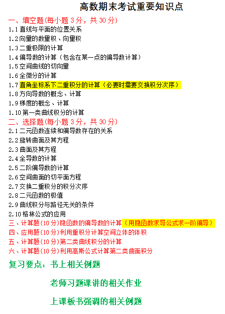
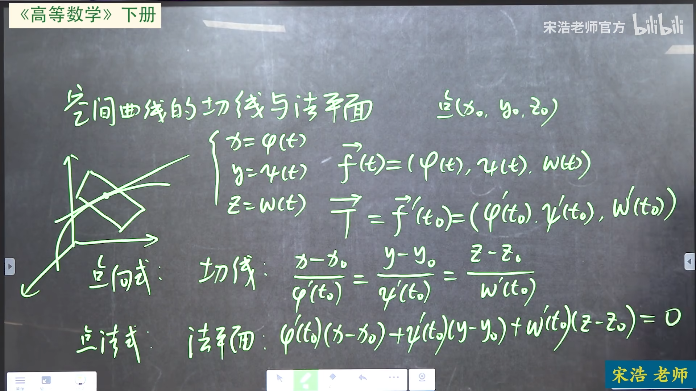
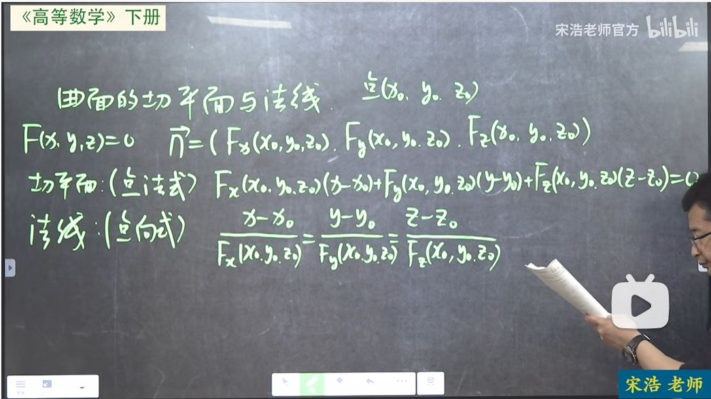
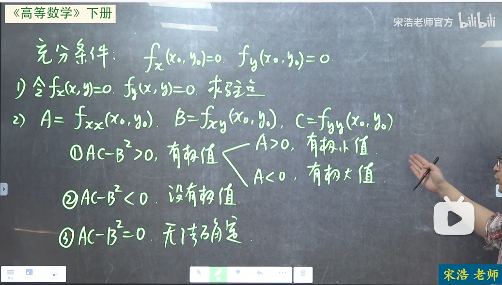
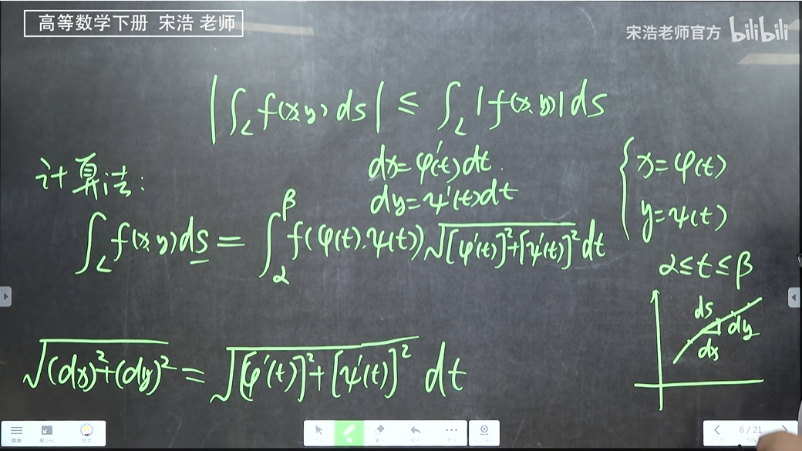
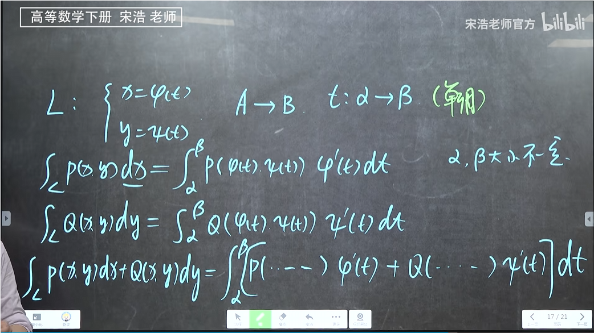
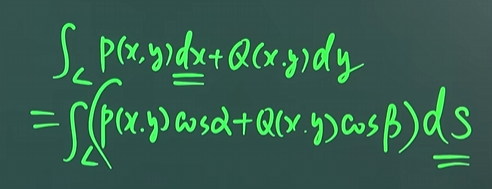
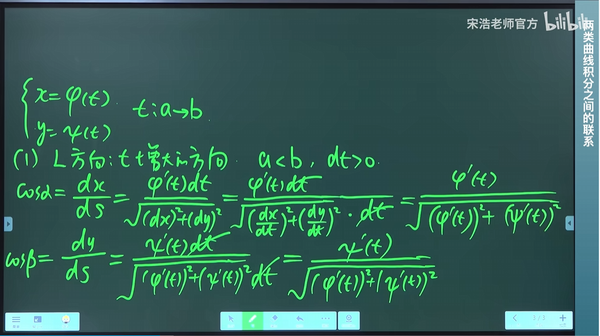
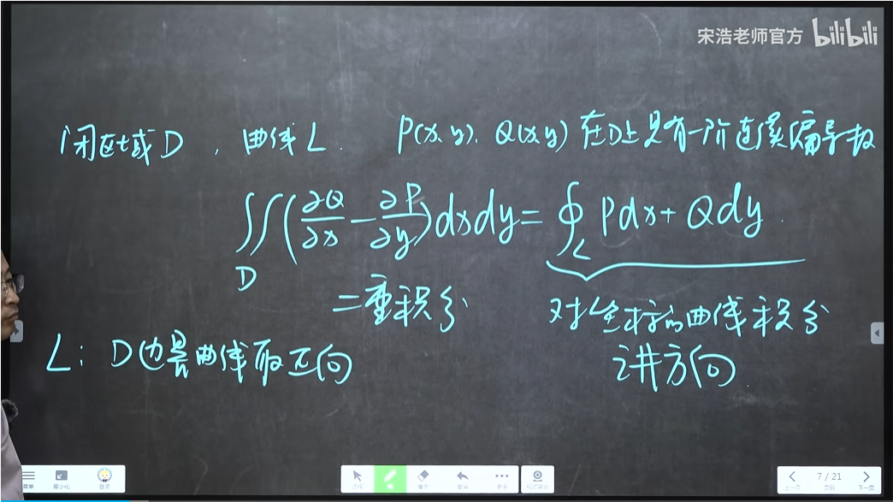
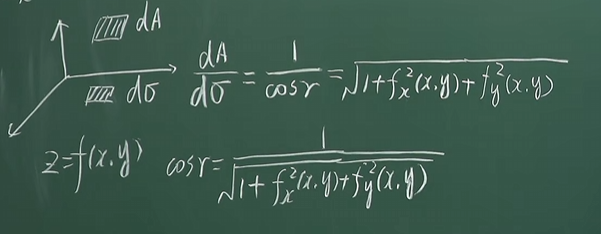

# 大一下期末复习

## 1.1 直线与平面位置关系

直线方向向量： $\vec{v}$
平面法向量： $\vec{u}$

 $\vec{v} \cdot \vec{u}=0$  ：直线与平面平行（需判断直线是否在平面上）
 $\vec{v} \cdot \vec{u}\neq 0$  ：直线与平面相交
 $\vec{v} \parallel \vec{u}$  ：直线与平面垂直

- 平面$Ax+By+Cz+D=0$ 的法向量就是 $(A,B,C)$

## 1.2 向量的数量积（点乘）、向量积（叉乘）

- 两个向量 $\vec{a}$ 和 $\vec{b}$ 的数量积为：
$$
\vec{a} \cdot \vec{b} = |\vec{a}| |\vec{b}| \cos \theta
$$

- 坐标运算
若 $\vec{a} = (x_1, y_1, z_1)$， $\vec{b} = (x_2, y_2, z_2)$，则：
$$
\vec{a} \cdot \vec{b} = x_1 x_2 + y_1 y_2 + z_1 z_2
$$

- 两个向量 $\vec{a}$ 和 $\vec{b}$ 的向量积为：
$$
\vec{a} \times \vec{b} = |\vec{a}| |\vec{b}| \sin \theta \cdot \vec{n}
$$

其中 $\vec{n}$ 是同时垂直于 $\vec{a}$ 和 $\vec{b}$ 的单位向量（方向由右手定则决定）。

- 坐标运算
若 $\vec{a} = (x_1, y_1, z_1)$， $\vec{b} = (x_2, y_2, z_2)$，则：
$$
\vec{a} \times \vec{b} = 
\begin{vmatrix}
\vec{i} & \vec{j} & \vec{k} \\
x_1 & y_1 & z_1 \\
x_2 & y_2 & z_2
\end{vmatrix}
= (y_1 z_2 - z_1 y_2,\; z_1 x_2 - x_1 z_2,\; x_1 y_2 - y_1 x_2)
$$

## 1.5.1空间曲线的切线与法平面

- $\vec{T}$ 为切向量

## 1.5.2曲面的切平面与法线

- $\vec{n}$ 为法向量

## 1.6 全微分

$$
dz = f_x(x_0, y_0) \cdot dx + f_y(x_0, y_0) \cdot dy
$$

## 1.8方向导数

- 概念：多元函数沿某个方向的斜率

如果函数 $f(x,y)$ 在点 $P_0$ 处可微，则沿单位方向向量 $\vec{u} = (u_1, u_2)$ 的方向导数为：

$$
\frac{\partial f}{\partial \vec{u}} = f_x(P_0) \cdot u_1 + f_y(P_0) \cdot u_2
$$

## 1.9梯度

梯度是一个二维向量

- 二元函数 $z = f(x, y)$ 的梯度：
  $$
  \text{grad } f = \nabla f = \left( \frac{\partial f}{\partial x}, \frac{\partial f}{\partial y} \right)
  $$

性质：

- 梯度方向是函数在该点上升最快的方向，即方向导数最大的方向

- 梯度的模长是上升最快的斜率

- 与梯度垂直的方向，函数值变化率为0

## 多元函数的极值

## 隐函数求导 

对于 $F(x,y)=0$ ：
$$
\frac{dy}{dx}=-\frac{F_x}{F_y}
$$

对于 $F(x,y,z)=0$ ：
$$
\frac{∂z}{∂x}=-\frac{F_x}{F_z}
$$

$$
\frac{∂z}{∂y}=-\frac{F_y}{F_z}
$$

## 二重积分

计算方法：化为“两次定积分”

- X型区域：  
区域由 $a \le x \le b$，$y_1(x) \le y \le y_2(x)$ 围成。  
  $$
  \iint_D f(x,y) \, dxdy = \int_a^b dx \int_{y_1(x)}^{y_2(x)} f(x,y) \, dy
  $$  
  计算时，先把 $x$ 看作常数，对 $y$ 积分；得到结果后再对 $x$ 积分。

Y型区域同理

- **改变积分次序**：将积分区域画出来重新积分

## 极坐标

$x=\rho\cos\theta$
$y=\rho\sin\theta$

$x^2+y^2=\rho ^2$

**换元后要把被积函数乘上 $\rho$**

$$
\iint_D f(x,y) \, dxdy = \iint_{D_{\rho\theta}} f(\rho\cos\theta, \rho\sin\theta) \cdot \rho \, d\rho d\theta
$$

## 旋转曲面

绕哪个轴转那个值就不变，剩下的值是半径，修改成旋转后的半径。

## 曲线积分

- 对弧长的曲线积分( $\alpha$ 一定小于 $\beta$ )

- 对坐标的曲线积分

- 判断方法：对坐标的曲线积分有明确的方向

**两类曲线积分的联系**

通过三角函数得到：

通过参数方程勾股定理换元求出 $\cos\alpha$ , $\cos\beta$ ：

- 如果曲线方向对应t从大到小，则需要加负号

## 格林公式

- 将曲线积分转化为二重积分

曲线积分的方向取逆时针方向（区域D始终在左手）

- 由此可以看出对坐标的曲线积分与路径无关的条件：  $\frac{∂Q}{∂x}=\frac{∂P}{∂y}$

## 曲面积分

**对面积的曲面积分**

- 计算方法：对一个方向投影后转换成二重积分，在被积函数后除以夹角的余弦即可

假设曲面 $\Sigma$ 的方程为 $z = z(x,y)$，在 $xOy$ 平面上的投影区域为 $D_{xy}$：

$$
\iint_\Sigma f(x,y,z) \, dS = \iint_{D_{xy}} f\big(x, y, z(x,y)\big) \sqrt{1 + z_x^2\left(x,y\right) + z_y^2\left(x,y\right)} \, dx \, dy
$$

原理： $z_x^2\left(x,y\right) + z_y^2\left(x,y\right)^2$ 其实是梯度的模长，即夹角 $r$ 的 $\tan$ 值，利用勾股定理即可得出 $\frac{1}{\cos r}$ 为 $\sqrt{1 + z_x^2\left(x,y\right) + z_y^2\left(x,y\right)^2}$

**对坐标的曲面积分**

$$
\iint_\Sigma R(x,y,z) \, dx\,dy = \pm \iint_{D_{xy}} R\big(x, y, z(x,y)\big) \, dx\,dy
$$

**步骤**：

1. 将曲面 $\Sigma$ 投影到 $xOy$ 平面，得到投影区域 $D_{xy}$ 。
2. 把曲面方程 $z = z(x,y)$ 代入被积函数 $R$ 中，消去 $z$ 。
3. 判断正负：正侧取正，负侧取负

- 上侧、右侧、前侧为正侧

## 高斯公式

- 将对坐标的闭曲面积分转化为三重积分

- 曲面积分取**外侧**

对于空间闭区域 $\Omega$ ，及其分片光滑闭曲面 $\Sigma$ ：

$$
\oiint_{\Sigma} P\,dy\,dz + Q\,dz\,dx + R\,dx\,dy = \iiint_\Omega \left( \frac{\partial P}{\partial x} + \frac{\partial Q}{\partial y} + \frac{\partial R}{\partial z} \right) \, dx\,dy\,dz
$$

- $P,Q,R$ 分别少 $x,y,z$ ，少谁就求谁的偏导

**the end**